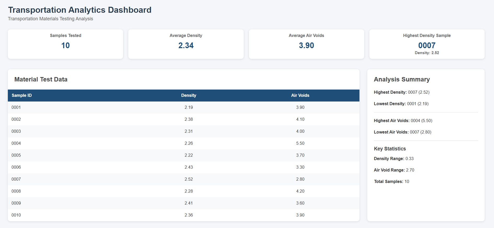
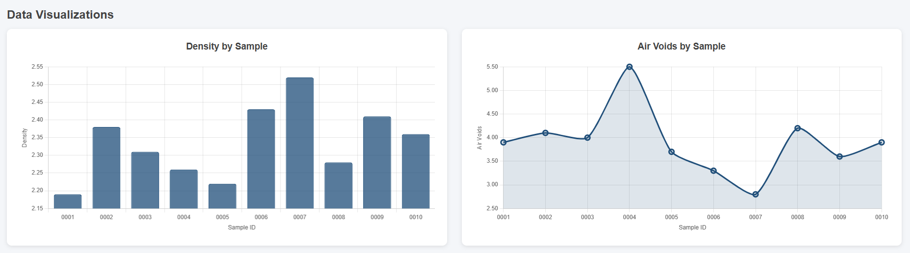

# Transportation Analytics Dashboard

A Spring Boot web application for analyzing transportation materials testing data. Import CSV files, store data in an H2 database, and visualize results with an interactive dashboard.

## Dashboard Preview

### Dashboard

### Data Visualizations

## Features

- CSV File Import
- Material Test Data Table
- Density and Air Voids Charts
- Analysis Summary
- Key Statistics Dashboard

## Technologies

- Java
- Spring Boot
- Spring Data JPA
- Thymeleaf
- H2 Database
- Chart.js
- Maven

## Author

Cole Strait
