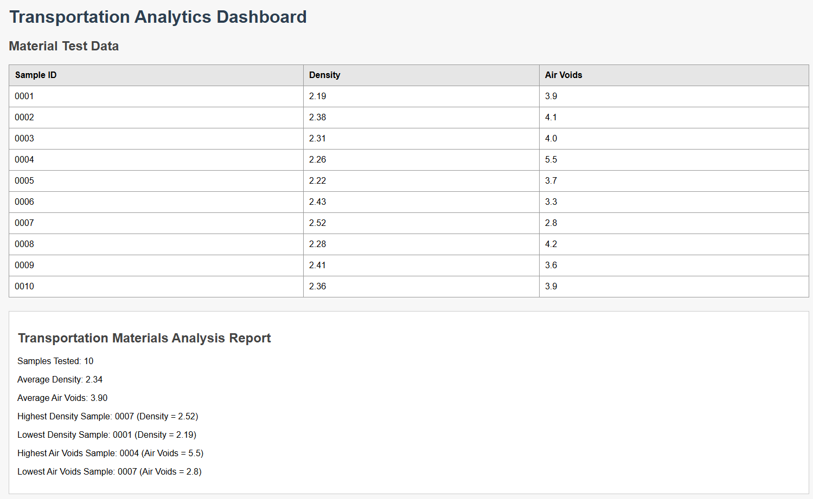

# Transportation Analytics Dashboard

This project is a Java Spring Boot application that analyzes transportation materials testing data.

The application loads data from a CSV file, stores it in an H2 database, and displays the results on a web dashboard. It also calculates summary statistics such as average density, average air voids, and the highest and lowest test values.

## Features

- Load material testing data from a CSV file
- Store data in an H2 database
- Display testing records in a web dashboard
- Calculate average density and air voids
- Find highest and lowest density samples
- Find highest and lowest air void samples

## Technologies Used

- Java
- Spring Boot
- Spring Data JPA
- H2 Database
- Thymeleaf
- HTML/CSS

## Dashboard

## Author

Cole Strait
